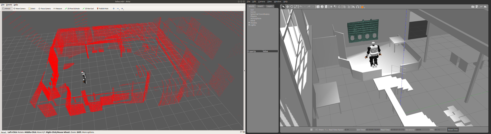

# Package Talos-bauzil

This package is a project to simulate Talos in the Bauzil room of LAAS-CNRS, Toulouse, France.

## What's needed?

This package needs:
 * `robotpkg-talos-data`: to install, see [this guide](http://robotpkg.openrobots.org/debian.html)
 * `ROS`
 * `Gazebo` with a modern build:
   * For Ubuntu 16.04: `Gazebo` version 7.14.0 or newer
   * For Ubuntu 18.04: `Gazebo` version 9.4.0 or newer
 * `Python 2.7` (not tested with `Python 3`)
---
## How to use

> If you do not want to use the GPU acceleration, replace `gpu="true"` by `gpu="false"` in the line 155 of `urdf/head/head_ouster.urdf.xacro`.  
> N.B.: This modification may degrade the simulation.

### For Ubuntu 16.04

This package is not usable on Ubuntu 16.04 yet.

### For Ubuntu 18.04

You can start the simulation with
```bash
python <path_to_package>script/start_talos_gazebo.py
```

### Examples

Below is an example of the data obtained with the simulator.


---
## Possible Errors

Here are some errors which can happen while using the simulator.

### Environment variables

The package is related to some work packaged in `robotpkg`. The path of the packages must be correctly placed in the environment variables. We recommend to ensures that the path is referenced first in the variables listed below (some items in the list may be missing or extra).
 * **`CMAKE_PREFIX_PATH`**
 * `LD_LIBRARY_PATH`
 * `PATH`
 * **`PKG_CONFIG_PATH`**
 * `PYTHONPATH`
 * `ROSLISP_PACKAGE_DIRECTORIES`
 * `ROS_PACKAGE_PATH`

### Gazebo version

As indicated in Part [What's needed?](#whats-needed-), to use the GPU acceleration, you need a modern build of `Gazebo`. If you forget to disable the GPU acceleration with an unadapted version of `Gazebo`, here are the problems you can encounter:
 * with `Gazebo7` version under 7.14.0, the simulated data can have a spherical appearance.
 * with `Gazebo9` version under 9.4.0, we observed crashes during the development of the package.

To overcome these errors, you can either disable the GPU acceleration (see [How to use](#how-to-use) note) or install a newer version of `Gazebo`, following [this guide](http://gazebosim.org/tutorials?tut=install_ubuntu) (replacing `sudo apt-get install `**`gazebo11`** with the wanted version of `Gazebo`).